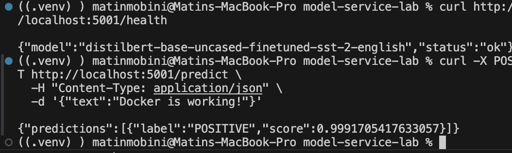
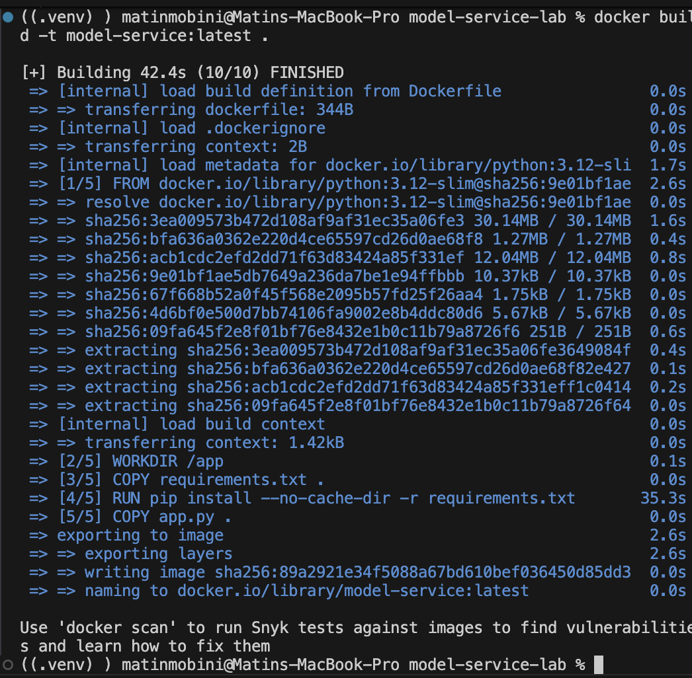
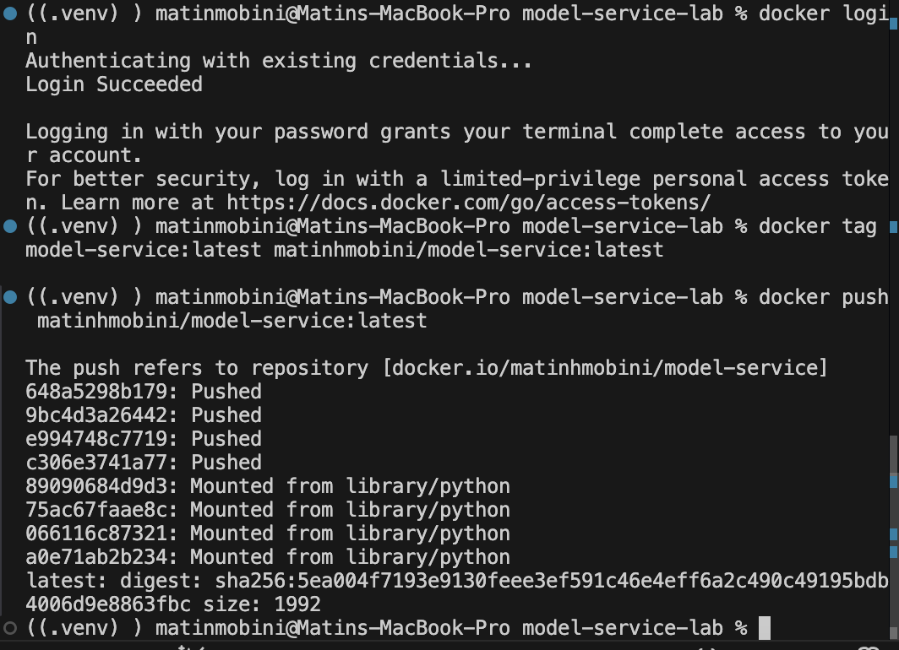

# Sentiment Analysis Model Service (Flask + Docker)

Serving a pretrained Hugging Face Transformers model as a production-style REST API with Flask and Waitress, packaged as a Docker image and published to Docker Hub.

## Overview

| | |
|---|---|
| **Model** | [`distilbert-base-uncased-finetuned-sst-2-english`](https://huggingface.co/distilbert-base-uncased-finetuned-sst-2-english): binary sentiment (POSITIVE / NEGATIVE) |
| **Serving** | Flask app served by **Waitress** (production WSGI server) |
| **Container** | `python:3.12-slim` base image, model loaded once at startup |
| **Config** | `MODEL_NAME` and `PORT` overridable via environment variables |

## API

| Method | Endpoint | Description |
|---|---|---|
| `GET` | `/health` | Liveness check; returns status and the loaded model name |
| `POST` | `/predict` | Body `{"text": "..."}`, accepts a single string **or a list of strings** |

```bash
curl http://localhost:5001/health
# {"model":"distilbert-base-uncased-finetuned-sst-2-english","status":"ok"}

curl -X POST http://localhost:5001/predict \
  -H "Content-Type: application/json" \
  -d '{"text": "Docker is working!"}'
# {"predictions":[{"label":"POSITIVE","score":0.9992}]}
```

Missing input returns `400` with a helpful message; inference errors return `500`.

<p align="center">
  
</p>

## Build & run

```bash
docker build -t model-service .
docker run --rm -p 5001:5000 model-service
```

The container listens on port 5000; it is mapped to 5001 on the host here (5000 is often taken on macOS by AirPlay).

Use a different Hugging Face text-classification model without rebuilding:

```bash
docker run --rm -p 5001:5000 -e MODEL_NAME=<hf-model-id> model-service
```

<p align="center">
  
  
</p>

## Run without Docker

```bash
pip install -r requirements.txt
python app.py      # serves on http://localhost:5001
```
